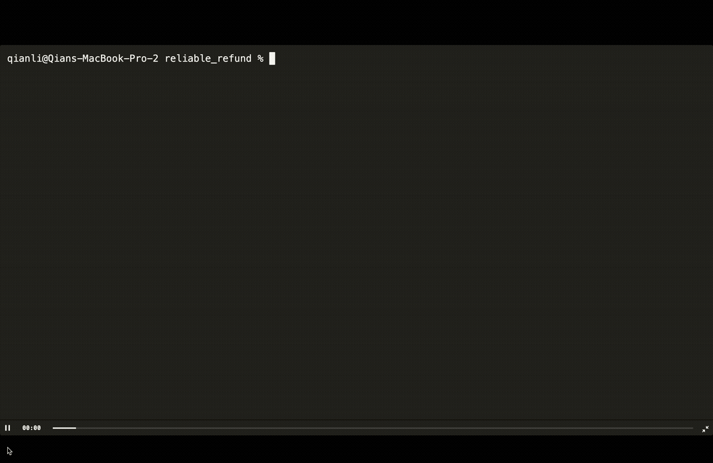

# Reliable Refund Agent

This example uses [DurableSwarm](https://github.com/dbos-inc/durable-swarm) to reliably orchestrate a refund agent.
It takes in a user's name, processes a refund for that user, then applies a discount.

The function for processing refunds takes a long time!
However, thanks to **durable execution**, even if the agent is interrupted during refund processing (or at any other time), upon restart it automatically recovers, finishes processing the refund, then proceeds to the next step in its workflow.



## How it works?

DurableSwarm augments Swarm with **durable execution** to help you build **reliable** multi-agent systems. It is a drop-in replacement for Swarm that makes your agentic workflows **resilient to any failure**, so that if they are interrupted or restarted, they automatically resume from their last completed steps.

Under the hood, it uses [DBOS](https://github.com/dbos-inc/dbos-transact-py) to persist your agentic workflows' execution state (which workflows are currently executing and which steps they've completed) in a Postgres database.

## Why Durable Execution?

As multi-agent workflows become more common, longer-running, and more interactive, it's important to make them **reliable**.
If an agent spends hours waiting for user inputs or processing complex workflows, it needs to be resilient to transient failures, such as server restarts.
However, reliable multi-agent orchestration isn't easy&mdash;it requires complex rearchitecting like routing agent communication through SQS or Kafka.

Durable execution helps you write reliable agents while preserving the **ease of use** of a framework like Swarm.
The idea is to automatically persist the execution state of your Swarm workflow in a Postgres database.
That way, if your program is interrupted, it can automatically resume your agentic workflows from their last completed steps.

## Making Swarm Durable

To add Durable Swarm to your project, simply create a `durable_swarm.py` file containing the following code:

```python
from swarm import Swarm
from dbos import DBOS, DBOSConfiguredInstance

DBOS()

@DBOS.dbos_class()
class DurableSwarm(Swarm, DBOSConfiguredInstance):
    def __init__(self, client=None):
        Swarm.__init__(self, client)
        DBOSConfiguredInstance.__init__(self, "openai_client")

    @DBOS.step()
    def get_chat_completion(self, *args, **kwargs):
        return super().get_chat_completion(*args, **kwargs)

    @DBOS.step()
    def handle_tool_calls(self, *args, **kwargs):
        return super().handle_tool_calls(*args, **kwargs)

    @DBOS.workflow()
    def run(self, *args, **kwargs):
        return super().run(*args, **kwargs)

DBOS.launch()
```

Then use `DurableSwarm` instead of `Swarm` in your applications&mdash;it's a drop-in replacement. For example:

```python
from swarm import Agent
from durable_swarm import DurableSwarm

client = DurableSwarm()
```

Under the hood, this works by declaring Swarm's main loop to be a durably executed workflow and each chat completion or tool call to be a step in that workflow.
DBOS persists the input of a workflow and the outputs of its steps in a Postgres database.
Therefore, if your workflow is ever interrupted, DBOS can automatically resume it from the last completed step!

## Try it out!

DBOS requires Postgres.
If you already have a Postgres server, modify `dbos-config.yaml` to configure its connection information.
Otherwise, we provide a [script](./start_postgres_docker.py) to start Postgres using Docker:

```
export PGPASSWORD=swarm
python3 start_postgres_docker.py
```

To run the demo:

```shell
pip install dbos git+https://github.com/openai/swarm.git
python3 run.py
```

You can press `Ctrl+C` at any point while the agent is processing your refund.
If you restart the program again, you'll see DBOS automatically recovers the incomplete workflow and resumes it from its last completed step.

For example:

```shell
> python3 main.py

Connecting to Durable Refund Agent 💪🐝
What's your name: Max
[mock] Refunding for Max, item item_99, because Too expensive and I don't like its color...
[mock] Processing refund step 1... Press Control + C to quit
[mock] Processing refund step 2... Press Control + C to quit
[mock] Processing refund step 3... Press Control + C to quit
^C⏎

# Resume from where the last completed step (step 3), continuing with step 4.
> python3 main.py

Connecting to Durable Refund Agent 💪🐝
[mock] Refunding for Max, item item_99, because Too expensive and I don't like its color...
[mock] Processing refund step 4... Press Control + C to quit
[mock] Processing refund step 5... Press Control + C to quit
[mock] Refund successfully processed!
[mock] Applying discount...
Refunds Agent:
process_refund("item_id"= "item_99", "reason"= "Too expensive and I don't like its color")
apply_discount()
Refunds Agent: I've processed the refund for item 99 and also applied a discount of 11% for your next purchase. If there's anything else you need, feel free to ask!

```

## Converting Existing Apps to DurableSwarm

You can convert any existing Swarm app to DurableSwarm in three simple steps:

1. Install `dbos` and initialize it with `dbos init --config`.
2. Add `durable_swarm.py` to your project.
3. Use `DurableSwarm` in place of `Swarm` in your application.

> [!NOTE]
> DurableSwarm currently doesn't support streaming